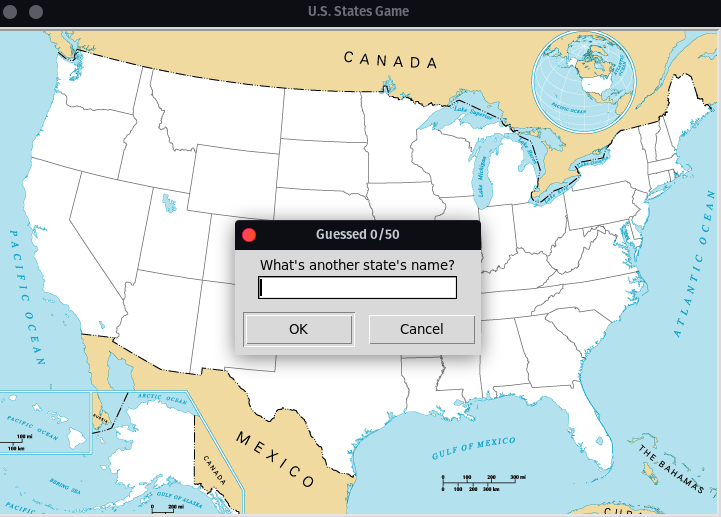

# U.S. States Guessing Game
This is a simple state guessing game in Python, which uses the turtle and pandas libraries to display the map of the United States and track the user's guesses. The game presents a blank map of the U.S. states, and the user is prompted to guess the name of the states one by one.

## Requirements
- Python 3
- Turtle library
- Pandas library
- CSV file containing the names of all 50 states, along with their coordinates on the map (50_states.csv)

## Getting Started
- Clone the repository to your local machine.
- Install the required libraries - Turtle and Pandas using pip.
- Ensure that the 50_states.csv file is located in the same directory as the Python file.
- Run the script "state_guessing_game.py" on your local machine.

## How to play
1. The game presents a blank map of the United States.
2. The user is prompted to guess the name of a state by entering its name in the dialog box.
3. If the user's guess is correct, the name of the state will appear on the map at its correct location.
4. The game continues, prompting the user to guess the name of the next state.
5. The game will end once the user has guessed all 50 states, or if the user enters "Exit".
6. When the game ends, the program will generate a CSV file containing the names of the states that the user didn't guess correctly.

## Acknowledgements
- The dataset "50_states.csv" is from the following website: https://github.com/aj-4/US-State-List-Csv/blob/master/states.csv
- The background image "blank_states_img.gif" is from the following website: https://www.jetpunk.com/quizzes/how-many-states-can-you-name#quiz-9817

## License
This project is licensed under the terms of the MIT license. See LICENSE.md for more details.